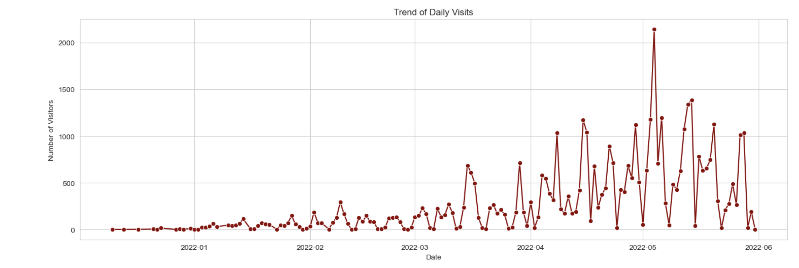
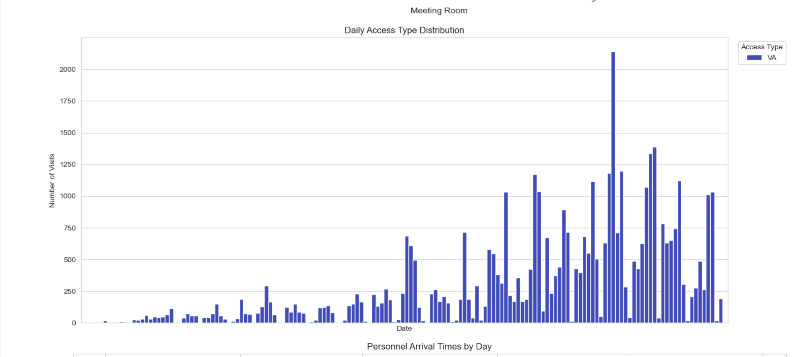
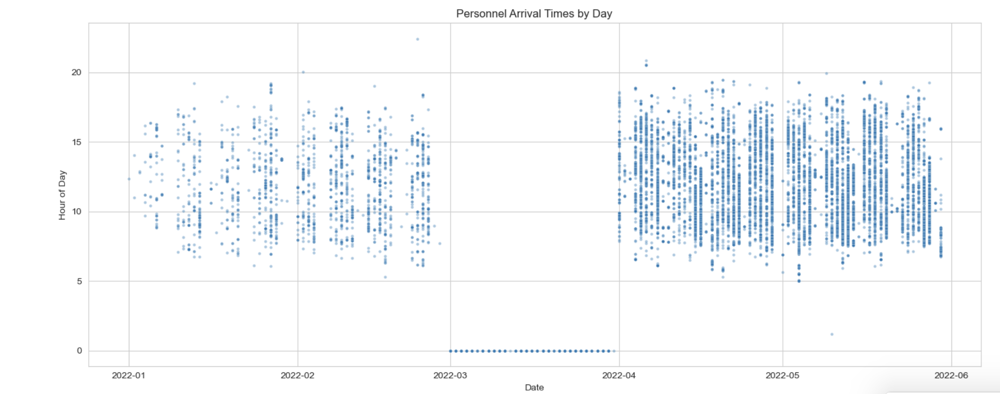
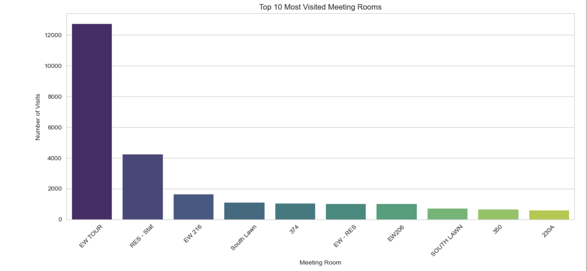
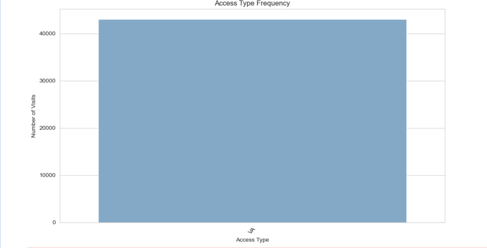
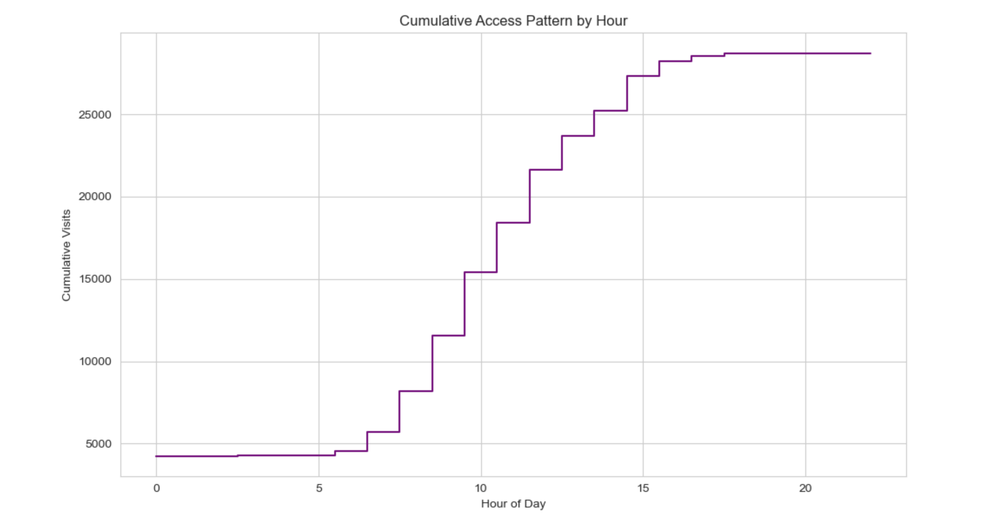
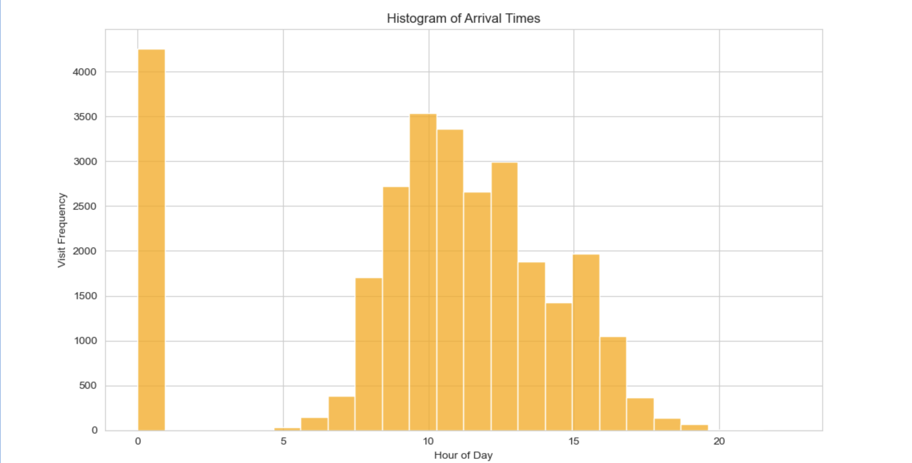

# CapitalTrafficFlow: White House Visitor Access Analysis

## Project Overview

CapitalTrafficFlow is a data analytics project focused on analyzing White House WAVES (Worker and Visitor Entry System) access records to uncover visitor traffic patterns, personnel arrival behaviors, facility utilization trends, and temporal access activity.

The project transforms raw visitor access logs into actionable intelligence through exploratory data analysis (EDA), statistical visualization, and traffic pattern assessment. By examining historical visitor access records, the analysis demonstrates how access-control data can support operational planning, security assessment, resource allocation, and facility management.

---

## Business Problem

Large facilities generate substantial access-control data that often remains underutilized. Understanding visitor patterns, workforce behavior, and facility utilization can improve security planning, operational efficiency, and resource allocation.

This project explores whether historical White House access records can reveal meaningful operational patterns that support decision-making and long-term planning.

---

## Project Objectives

* Analyze visitor traffic patterns.
* Evaluate personnel arrival behaviors.
* Identify peak traffic periods.
* Examine facility utilization trends.
* Investigate access-type distributions.
* Visualize cumulative traffic behavior.
* Generate actionable operational insights.

---

## Dataset

The dataset consists of White House WAVES access records containing visitor and personnel access information, including:

* Access timestamps
* Visitor records
* Personnel records
* Meeting locations
* Arrival information
* Access classifications
* Facility utilization data

The dataset was cleaned and transformed to support exploratory analysis and visualization.

---

## Methodology

### 1. Data Collection

* Imported White House WAVES access records.
* Verified data integrity.
* Examined missing values and inconsistencies.

### 2. Data Cleaning

* Standardized date and time fields.
* Removed invalid records.
* Formatted categorical variables.
* Prepared data for visualization.

### 3. Exploratory Data Analysis (EDA)

* Daily traffic analysis.
* Hourly access pattern evaluation.
* Visitor classification analysis.
* Meeting room utilization assessment.
* Personnel arrival trend analysis.

### 4. Visualization Development

Multiple visualizations were developed to identify:

* Daily visitor trends
* Access-type distributions
* Peak traffic periods
* Facility utilization patterns
* Cumulative traffic behavior

---

## Thought Process

The primary objective was to determine whether historical visitor access records could reveal meaningful operational patterns.

Questions explored included:

* Which days experience the highest visitor volume?
* What time periods experience the greatest traffic concentration?
* Which meeting locations receive the most activity?
* Are visitor arrivals concentrated around specific periods?
* Can traffic behavior support future planning efforts?

By transforming raw access logs into visual analytics, hidden patterns become significantly easier to interpret and communicate.

---

# Visualizations

## Project Thumbnail



Primary project visualization used throughout the portfolio and repository branding.

---

## Daily Access Type Distribution



Examines the distribution of visitor access classifications and reveals how different visitor categories contribute to overall facility traffic.

---

## Personnel Arrival Times by Day



Analyzes workforce arrival behavior across multiple days and identifies recurring arrival patterns and operational schedules.

---

## Top 10 Most Visited Meeting Rooms



Highlights the most frequently utilized meeting locations and provides insight into facility utilization patterns.

---

## Access Type Frequency



Displays frequency counts across visitor access categories and personnel classifications.

---

## Cumulative Access Pattern by Hour



Illustrates how visitor activity accumulates throughout the day and identifies peak operational periods.

---

## Histogram of Arrival Times



Provides a statistical view of visitor and personnel arrival distributions and reveals concentration around specific time periods.

---

## Key Findings

The analysis revealed several important patterns:

* Visitor activity follows predictable daily cycles.
* Traffic volume is concentrated within specific operational windows.
* Certain meeting locations consistently receive higher traffic.
* Arrival times cluster around common access periods.
* Access activity demonstrates measurable peak and off-peak behaviors.
* Historical access data can support security and operational planning.

---

## Business Impact

This project demonstrates how access-control systems can generate valuable operational intelligence.

Potential applications include:

* Security planning
* Facility management
* Resource allocation
* Workforce scheduling
* Visitor forecasting
* Capacity management
* Operational efficiency monitoring

The methodology can be adapted to:

* Government facilities
* Healthcare organizations
* Manufacturing sites
* Corporate campuses
* Research institutions

---

## Skills Demonstrated

### Data Science

* Exploratory Data Analysis (EDA)
* Data Cleaning
* Statistical Analysis
* Trend Identification

### Data Visualization

* Histograms
* Distribution Analysis
* Time-Series Visualization
* Comparative Analysis

### Python Analytics

* Pandas
* NumPy
* Matplotlib
* Seaborn

### Business Intelligence

* Traffic Flow Analytics
* Facility Utilization Analysis
* Operational Reporting
* Decision Support Analytics

---

## Technologies Used

* Python
* Pandas
* NumPy
* Matplotlib
* Seaborn
* Jupyter Notebook

---

## Repository Structure

```text
CapitalTrafficFlow/
│
├── notebook/
│   └── CapitalTrafficFlow.ipynb
│
├── visuals/
│   ├── CapitalTrafficFlowAI.png
│   ├── access_type_frequency.png
│   ├── cumulative_access_pattern_by_hour.png
│   ├── daily_access_type_distribution.png
│   ├── histogram_of_arrival_times.png
│   ├── personnel_arrival_times_by_day.png
│   └── top_10_most_visited_meeting_rooms.png
│
├── data/
├── docs/
├── README.md
├── requirements.txt
└── .gitignore
```

---

## Installation

Clone the repository:

```bash
git clone https://github.com/Dare215/CapitalTrafficFlow.git
```

Navigate into the project:

```bash
cd CapitalTrafficFlow
```

Install dependencies:

```bash
pip install -r requirements.txt
```

Launch Jupyter Notebook:

```bash
jupyter notebook
```

Open:

```text
notebook/CapitalTrafficFlow.ipynb
```

---

## Future Improvements

Potential enhancements include:

* Traffic forecasting models
* Time-series prediction
* Machine learning classification
* Streamlit dashboard deployment
* Power BI integration
* Interactive visualizations
* Automated reporting workflows

---

# Author

**Darious Brown**
PhD Candidate – Artificial Intelligence & Machine Learning Specialization
DBA Candidate
Data Scientist | Machine Learning Engineer | AI Researcher

### Professional Profiles

GitHub: https://github.com/Dare215

LinkedIn: https://www.linkedin.com/in/dariousbrown

Portfolio: https://dare215.github.io/DariousBrown-Portfolio/

Email: [dariousbrown3@icloud.com](mailto:dariousbrown3@icloud.com)

---

## Areas of Expertise

* Artificial Intelligence
* Machine Learning
* Deep Learning
* Generative AI
* Natural Language Processing
* Computer Vision
* Predictive Analytics
* Data Science
* Financial Analytics
* Healthcare Analytics
* Manufacturing Analytics

---

## About This Portfolio

This repository is part of a larger Artificial Intelligence and Data Science portfolio showcasing machine learning, deep learning, predictive analytics, natural language processing, generative AI, computer vision, forecasting, optimization, and business intelligence projects developed throughout graduate and doctoral studies.

---

# License

This project is intended for educational, research, and portfolio demonstration purposes.
